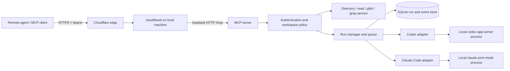

# AgentGo implementation plan

Prepared 2026-10-06. Target: a personal remote MCP client that can send custom authentication headers. Implemented in this repository. See README.md for setup and current limits. User refinement: both CLIs always use their native auto-approval mode; no per-run policy input is exposed.

## 1. Product boundary

Run a local daemon that exposes Codex and Claude Code through authenticated MCP over HTTP. Cloudflared publishes the HTTP endpoint. The remote agent can discover approved workspaces, inspect files, launch work, poll progress, retrieve results, cancel work, and continue a previous conversation.

The daemon owns durable jobs. An HTTP request, MCP connection, tunnel connection, CLI process, and provider conversation are separate lifetimes.

Initial assumptions:

- Single machine and owner; macOS first, matching the current environment.
- Existing local CLI installations and locally configured provider authentication.
- Bearer tokens for the custom remote client. OAuth is outside v1.
- Both providers in v1, with explicitly different capability sets where necessary.
- Approved workspace roots, configured locally. Remote callers cannot expand them.
- No model, reasoning effort, or tier is silently substituted.
- No automatic commit, push, merge, or publishing behavior added by the server.

## 2. What to reuse from PrintGo

Inspected `/Users/nishkal/Desktop/github-repos/local-printer-mcp`:

| Source | Reuse/adaptation |
| --- | --- |
| `src/server.ts` | Loopback binding, bearer verification, host/origin validation, bounded JSON MCP requests, stateless HTTP handling |
| `src/mcp.ts` | Shared service behind per-request MCP transport instances, Zod tool schemas, structured results |
| `src/cloudflare.ts` | Cloudflared discovery/install, Quick/named/token tunnel configuration |
| `src/lifecycle.ts`, `src/cli.ts` | Start, stop, status, restart, stdio, JSON CLI output |
| `src/storage.ts` | Private state directories, atomic configuration writes, lifecycle locking |
| `src/client.ts` | Typed MCP client wrapper |
| `tests/fixtures`, `scripts/smoke-tunnel.mjs` | Fake subprocesses and real tunnel smoke-test pattern |

Reuse selected source with its license attribution initially. Avoid depending on the printer package or extracting a shared hosting package until the second implementation makes the common boundary clear. Printer, PDF, browser, font, and asset-download dependencies do not belong here.

Change PrintGo's daemon lifecycle: its cloudflared exit handler shuts down the daemon. Here, restart the tunnel with bounded exponential backoff while the local HTTP server and active runs continue. Keep tunnel health separate from worker health.

## 3. Architecture



Use TypeScript, Node, Zod, and the same MCP SDK family as PrintGo, with explicitly tested and pinned compatibility. SQLite stores runs, sessions, normalized events, idempotency records, and workspace locks. Choose a supported SQLite binding during scaffolding and pin its supported Node range.

Use JSON responses and short MCP requests. Incremental local CLI output becomes stored events retrieved by cursor; it does not require an internet SSE connection. Quick Tunnels currently do not support SSE and are intended for development. Recommend a named tunnel for daily use: [Cloudflare Quick Tunnels](https://developers.cloudflare.com/tunnel/get-started/quick-tunnels/).

Do not require protocol-level MCP Tasks for v1. Application-level `taskId` polling works with the intended client and PrintGo's transport pattern. A future MCP Tasks adapter can wrap the same run manager.

## 4. MCP tools

Use named JSON arguments and strict schemas, not positional arguments.

| Tool | Main inputs | Result |
| --- | --- | --- |
| `getAgentCapabilities` | optional provider | Installed CLI versions, health, supported operations and fixed auto-approval behavior |
| `getSupportedModels` | provider, optional refresh | Model-specific effort/tier metadata, source, freshness, discovery limitations |
| `listWorkspaces` | none | Locally approved workspace IDs, labels, fixed auto-approval behavior |
| `listDirectory` | workspaceId, path, cursor, limit | Immediate children, types, next cursor |
| `globFiles` | workspaceId, pattern, limit, cursor | Matching relative file paths |
| `grepFiles` | workspaceId, pattern, optional fileGlob, literal/case options, limit | Relative path, line number, bounded match/context |
| `readFile` | workspaceId, path, startLine, maxLines | Bounded text and truncation metadata |
| `startAgentRun` | provider, prompt, workspaceId, cwd, model, effort, optional serviceTier, idempotencyKey, limits | Durable taskId, sessionId, initial status, accepted configuration |
| `getAgentRunStatus` | taskId | State, timestamps, latest activity, usage if available, pending action/error, next cursor |
| `getAgentRunOutput` | taskId, cursor, limit | Ordered events, next cursor, moreAvailable, terminal result if present |
| `listAgentRuns` | optional state/workspace filters, cursor | Recoverable run history |
| `cancelAgentRun` | taskId | Cancellation requested/already terminal |
| `continueAgentSession` | sessionId, prompt, idempotencyKey | New taskId in the same provider conversation |

`getAgentCapabilities` is deliberately separate from model discovery: an installed CLI can support resume while a particular model lacks a requested effort level. Every tool checks the caller's workspace/run access.

Example input (model and tier are illustrative and must be validated against discovery):

```json
{
  "provider": "codex",
  "model": "gpt-6.2-sol",
  "effort": "high",
  "serviceTier": "priority",
  "workspaceId": "agentgo",
  "cwd": ".",
  "prompt": "Implement the agreed change and run the relevant checks.",
  "idempotencyKey": "remote-task-123-attempt-1",
  "limits": { "wallTimeSeconds": 1800 }
}
```

Prefer `cwd` to `pwd`; use a path relative to the selected workspace. An optional absolute-path convenience API can resolve only to an existing approved root. Never let a remote `cwd` register a new root.

Use opaque server `sessionId` and per-invocation `taskId`. Store native Codex thread/turn IDs and Claude session IDs internally. Continuing a completed session creates a new task, preserving previous results. Serialize active work within a session. Provider changes require a new session; do not pretend Claude and Codex conversations are interchangeable.

The directory request appears to mean filesystem discovery. Provide list/read/glob/grep explicitly. A separate `done` tool is unnecessary: completion comes from provider lifecycle events. A model saying “done” is not sufficient to mark a run successful.

## 5. Provider adapters and capability discovery

Verified locally without starting inference:

- Codex CLI `0.160.1`: `exec --json`, explicit model/cwd/sandbox configuration, resume, and `app-server` are present.
- Generated local app-server TypeScript schemas confirm `Model.supportedReasoningEfforts`, `Model.serviceTiers`, `TurnStartParams.effort`, and `TurnStartParams.serviceTier`.
- Claude Code `2.1.291`: print mode, stream-json output, model and effort flags, resume/session IDs, permission controls, and budget flags are present.

This verifies interface availability, not account entitlement to any example model or tier.

**Codex:** prefer a private `codex app-server --listen stdio://` child owned by this service. Use initialize/initialized, `model/list`, thread start/resume, turn start/interrupt, and structured notifications. This is a supported integration surface but is marked experimental in the installed CLI; pin and test the CLI/protocol pairing. Never attach to unrelated user sessions or expose the app-server socket directly to the internet. The documented app-server supports model discovery and approval requests: [Codex app-server](https://developers.openai.com/codex/app-server/).

Store model, effort and tier per run, and pass them explicitly. Discover model-specific tier IDs; if our public API accepts `priority` while a verified CLI catalog exposes `fast`, use an explicit versioned mapping and report it. Configuration documentation describes `fast` mapping to request tier `priority`: [Codex configuration](https://developers.openai.com/codex/config-reference/). Do not infer tier support from the model name or silently fall back.

**Claude:** start with the installed `claude -p --output-format stream-json --verbose` CLI, pass the prompt through stdin, set the validated model/effort and fixed native auto mode, and capture the native session ID. Use an explicit session ID for resume. Use print-mode permission denial behavior to prevent unattended runs from hanging on prompts. The documented CLI provides structured results and session continuation: [Claude programmatic usage](https://code.claude.com/docs/en/headless).

Do not invent a Claude `--list-models` flag. For v1, return a locally configured, versioned Claude model allowlist with `source: configured` and `availability: unverified` until tested. Probe the official Agent SDK's model-information interface in the adapter spike; adopt it if it works with the intended installed binary/authentication and provides better discovery. Keep discovered and configured metadata distinguishable. No paid inference probes on every discovery request.

Reject a Claude `serviceTier` unless the adapter can explicitly support and verify its semantics; do not equate Claude fast mode with Codex priority. Reasoning/effort values are per provider and model, not a global enum with identical meaning.

Suggested discovery envelope:

```ts
type ModelCapability = {
  provider: "codex" | "claude";
  id: string;
  displayName: string;
  efforts: string[] | null; // null means unknown, not unrestricted
  serviceTiers: string[] | null;
  source: "runtime" | "configured";
  availability: "advertised" | "verified" | "unverified";
  checkedAt: string;
};
```

Cache results briefly; refresh on demand and after CLI changes. Runtime advertisement is not a guarantee of entitlement. Authentication and backend rejection remain explicit run errors. Return requested, accepted, and provider-reported configuration separately; unknown effective values remain unknown.

## 6. Run lifecycle and reliability

States: `queued -> starting -> running -> succeeded | failed | cancelled | timed_out | interrupted`. Reserve `waiting_for_input` for adapters that actually support responding; v1 unattended CLI calls fail/deny clearly when required actions cannot be approved.

- Persist the task, canonical request fingerprint and idempotency key transactionally before acknowledging it. Scope keys to caller and operation. The same key/input returns the original task; different input is `IDEMPOTENCY_CONFLICT`.
- Claim jobs transactionally. Bound global concurrency; start with two runs and at most one writing run per workspace. Hold the workspace lock for the active session turn, including any wait state.
- Persist ordered events before publishing their cursor. Coalesce token deltas and cap event, transcript and response sizes so long jobs do not grow memory or disk without bounds.
- Suggested initial bounds: 64 KiB prompts, 256 KiB output pages, 30 minute run timeout configurable locally, and a bounded retained history. Final values must account for actual MCP envelope sizes.
- Normalize visible messages, tool activity, file changes, usage, provider errors and terminal results. Do not export hidden reasoning, credentials, unrestricted debug logs, or unrelated native session history.
- Distinguish runner liveness, provider activity and elapsed time. No fabricated completion percentage. No output alone does not prove a hang.
- Store final assistant output and provider terminal outcome. Report token/cost fields only when supplied; a missing cost is `null`, not zero. Provider completion does not certify that the requested code is correct.
- Cancellation interrupts the provider, then terminates the owned process tree after a grace period if necessary. Do not mark cancelled while owned work still runs. Cancellation does not roll back file edits or external effects.
- Network disconnects and tunnel restarts leave tasks running. A Quick Tunnel may return with a new URL; a named tunnel avoids endpoint rediscovery.
- After a daemon crash, reconcile owned workers using identity beyond a bare PID. Uncertain active jobs become `interrupted`; do not automatically replay them or silently launch duplicates. Resume requires an explicit continuation and a usable provider session.
- Reject new writes when disk persistence fails. Stop or interrupt affected work if results cannot be recorded reliably, and preserve an explicit failure state where possible.

On normal shutdown, drain or explicitly cancel active work using a documented policy. Persist partial outputs. Starting the daemon does not automatically repeat interrupted prompts.

Optional worktrees can later allow concurrent writers. They isolate edits, not filesystem or network privileges; never merge or delete a user's working tree implicitly.

## 7. Filesystem and execution policy

Direct filesystem tools use locally registered roots, relative paths, realpath containment and symlink checks. Avoid following symlinks out of roots; defend against path/symlink races using safe open/containment mechanisms appropriate to the OS. Restrict reads to regular files; reject FIFOs/devices and bound file sizes, recursion, result counts and execution time.

Implement grep with `rg --json` and an argument array, with `--` separating untrusted operands. No shell interpolation, user-supplied executable paths, arbitrary CLI flags, environment overrides, or raw ripgrep flags. Respect ignore files by default, with an explicit local policy for hidden/ignored files. Deny credential/config locations such as `.env`, private keys, and provider auth files by default; never scan the home directory implicitly.

These checks secure the direct browsing tools. They do not by themselves confine an agent that can run shell commands. `cwd`, Git worktrees, Codex write sandboxing and Claude permission prompts are not interchangeable with strict read isolation.

Execution policy is fixed: Codex uses `on-request` plus `auto_review` with workspace-write sandboxing; Claude uses `--permission-mode auto --permission-prompts none`. No policy selection is exposed in tools. Fail if the provider reports a different mode. Direct workspace browsing restrictions are not a full agent sandbox. For hostile clients or repositories, use a dedicated OS identity or isolated runtime.

Control which user/project configuration, hooks, plugins and nested MCP servers are loaded. They can expand privileges or recursively call this service. Vet execution configuration locally and do not inherit the hosting daemon's tunnel/admin tokens into child processes. Preserve intended project instructions without treating those instructions as authorization to expand access.

For v1, native automatic reviewers decide approvals; denials are reported, and interactive requests cannot be answered. Later, expose pending approval requests to a separate authorized approval channel. Giving the launching agent the same approval power adds no human oversight; any such delegation must be deliberate and bounded.

## 8. Internet hosting and authentication

Bind the MCP server to `127.0.0.1`; cloudflared creates the outbound connection. No inbound router port or hosted worker is necessary. Cloudflare carries the traffic; this is not end-to-end encryption bypassing Cloudflare.

Use a cryptographically random bearer token, support local rotation/revocation, and store secrets in owner-only files. Never include tokens in URLs or child environments. Keep admin lifecycle control on a local Unix socket or separate non-tunneled listener, rather than exposing `/internal/stop` through the tunnel.

Validate Host and Origin against the active endpoint; apply request-size limits, per-caller rate limits and concurrency limits. Authenticate before tools or output can be accessed. Bind each run/session to its caller and workspace permissions, even if v1 starts with one owner token. Audit starts, cancellation and policy denial without logging secrets.

Keep application bearer authentication even if Cloudflare Access is added. Access service tokens are an optional second layer for a custom client and are distinct from MCP bearer credentials. No interactive Cloudflare login page should sit in the client's automated request path.

A static bearer token is appropriate for this explicitly selected custom client. Do not advertise it as a complete MCP OAuth implementation. If general hosted connectors become a target, implement and test the MCP authorization flow separately: [MCP authorization](https://modelcontextprotocol.io/specification/2026-07-28/basic/authorization).

Recommended operator flow (proposed commands, not implemented):

```sh
agentgo doctor
agentgo workspace add agentgo /Users/nishkal/Desktop/github-repos/agent-mcp
agentgo start --quick
agentgo start --custom-domain-with-cf agents.example.com
agentgo status
agentgo token rotate
agentgo stop
```

Use the Quick and named start examples as alternatives. Return the MCP URL and bootstrap credential through local setup only. `doctor` checks binaries, versions, auth readiness without printing credentials, supported policies, state permissions and cloudflared. It does not start a paid agent run.

## 9. Implementation order and acceptance criteria

1. **Adapter spike and contract.** Test the installed versions in a disposable approved workspace: model metadata, exact model/effort/tier propagation, structured events, completion, resume, permissions and cancellation. Establish Claude discovery limitations and authentication behavior. This is the only phase that should settle uncertain provider details before committing the public contract.
2. **Local service core.** Implement schemas, workspace registry, SQLite store, queue, idempotency, filesystem tools, fake adapters and stdio transport. Verify retries, path containment, locks, truncation, ownership and crash-state reconciliation.
3. **Real providers.** Implement Codex app-server and Claude print-mode adapters; add version checks and actionable errors. Verify two-turn session continuation, unsupported options, provider denial, timeout and process-tree cancellation. Confirm required local authentication works in daemon context.
4. **HTTP and tunnel.** Adapt PrintGo transport/hosting, bearer rotation and host validation. Isolate local admin controls. Test a real authenticated MCP client through Quick and named tunnels, including disconnect/reconnect while a job is active.
5. **Operational hardening.** Add retention, audit events, bounded resource use, local service startup support and typed client ergonomics. Document shutdown, sleeping/offline machines, auth expiry and recovery behavior.

Use fake CLIs for repeatable tests: chunked/malformed JSON, large output, process exit without terminal event, duplicate terminal events, timeout, permissions denial and interrupted sessions. Use real, small provider smoke tests only where they validate the actual integration. Do not start a review loop unless separately requested.

End-to-end acceptance: the remote client discovers an approved workspace and model, reads/searches files, starts a task, observes progress, receives the final output, resumes its session, cancels another task, and recovers after a tunnel restart. Duplicate starts do not duplicate work; unapproved filesystem access and unsupported configurations fail clearly.

## 10. Deferred work

OAuth/general hosted connectors, interactive input and steering, worktree orchestration, protocol-native Tasks, optional event subscriptions, multi-machine routing, Windows-specific process supervision, and review-loop orchestration can follow the core service. The v1 architecture should leave room for them without advertising capabilities it cannot enforce.
